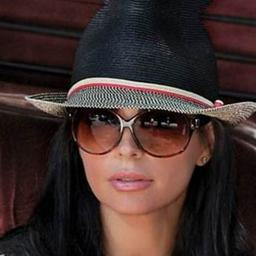
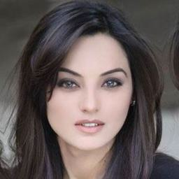
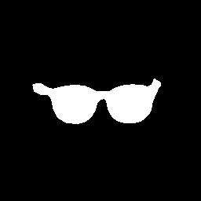
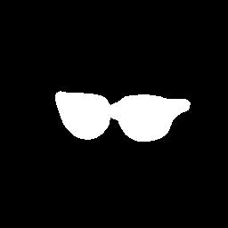

# Glasses Detector

[](https://pypi.org/project/glasses-detector/)
[](https://docs.python.org/3/)
[](https://developer.nvidia.com/cuda-toolkit)
[](https://mantasu.github.io/glasses-detector/)
[](https://zenodo.org/badge/latestdoi/610509640)
[](https://opensource.org/licenses/MIT)

**Eyeglasses** and **sunglasses** _classifier_ + **glasses** and their **frames** _segmenter_. This project provides scripts to download the corresponding datasets, train the corresponding models and by itself is a PyPi project that provides a quick way to use the trained models via python script or terminal.

> **Note**: `src` in main branch is in development - do not clone it yet, instead, clone the latest release for now.

## Installation

Minimum version of [Python 3.10](https://www.python.org/downloads/release/python-3100/) is required. Also, you may want to install [Pytorch](https://pytorch.org/get-started/locally/) in advance for your device to enable GPU support. Note that _CUDA_ is backwards compatible, thus even if you have the newest version of [CUDA Toolkit](https://developer.nvidia.com/cuda-toolkit), _Pytorch_ should work just fine.

### Pip Package

If you only need the interface, just install the pip package and see _Examples_ section or read the [documentation page](https://mantasu.github.io/glasses-detector/) of how to use it:

```bash
pip install glasses-detector
```

You can also install it from source:

```bash
git clone https://github.com/mantasu/glasses-detector
cd glasses-detector && pip install .
```

### Local Project

If you want to train your own models on the given datasets (or on some other datasets), just clone the project and install training requirements, then see _Running_ section to see how to run training and testing.

```bash
git clone https://github.com/mantasu/glasses-detector
cd glasses-detector && pip install -r requirements.txt
```

You can create a virtual environment for your packages via [venv](https://docs.python.org/3/library/venv.html), however, if you have conda, then you can simply use it to create a new environment, for example:

```bash
conda create -n glasses-detector python=3.11
conda activate glasses-detector 
```

To set-up the datasets for the 4 tasks (2 classification and 2 segmentation tasks), refer to _Data_ section.

## Features

There are 2 kinds of classifiers and 2 kinds of segmenters (terminology is a bit off but easier to handle with unique names):
* **Eyeglasses classifier** - identifies only transparent glasses, i.e., prescription spectacles.
* **Sunglasses classifier** - identifies only occluded glasses, i.e., sunglasses.
* **Full glasses segmenter** - segments full glasses, i.e., their frames and actual glasses (regardless of the glasses type).
* **Glasses frames segmenter** - segments glasses frames (regardless of the glasses type).

Each kind has 5 different model architectures with naming conventions set from *tiny* to *huge*.

### Classification

A classifier only identifies whether a corresponding category of glasses (transparent eyeglasses or occluded sunglasses):

| Model type             |  |  |  |
| ---------------------- | ------------------------------------ | ------------------------------------ | ------------------------------------ |
| Eyeglasses classifier  | wears                                | doesn't wear                         | doesn't wear                         |
| Sunglasses classifier  | doesn't wear                         | wears                                | doesn't wear                         |
| Any glasses classifier | wears                                | wears                                | doesn't wear                         |

These are the performances of _eyeglasses_ and _sunglasses_ models and their sizes. Note that the joint _glasses_ classifier would have an average accuracy and a combined model size of both _eyeglasses_ and _sunglasses_ models.

<details>

<summary><b>Eyeglasses classification models (performance & weights)</b></summary>

| Model type                   | BCE loss $\downarrow$ | F1 score $\uparrow$ | ROC-AUC score $\uparrow$ | Num params $\downarrow$ | Model size $\downarrow$ |
| ---------------------------- | --------------------- | ------------------- | ------------------------ | ----------------------- | ----------------------- |
| Eyeglasses classifier tiny   | TBA                   | TBA                 | TBA                      | TBA                     | TBA                     |
| Eyeglasses classifier small  | TBA                   | TBA                 | TBA                      | TBA                     | TBA                     |
| Eyeglasses classifier medium | TBA                   | TBA                 | TBA                      | TBA                     | TBA                     |
| Eyeglasses classifier large  | TBA                   | TBA                 | TBA                      | TBA                     | TBA                     |
| Eyeglasses classifier huge   | TBA                   | TBA                 | TBA                      | TBA                     | TBA                     |

</details>

<details>

<summary><b>Sunglasses classification models (performance & weights)</b></summary>

| Model type                   | BCE loss $\downarrow$ | F1 score $\uparrow$ | ROC-AUC score $\uparrow$ | Num params $\downarrow$ | Model size $\downarrow$ |
| ---------------------------- | --------------------- | ------------------- | ------------------------ | ----------------------- | ----------------------- |
| Sunglasses classifier tiny   | 0.1149                | 0.9137              | 0.9967                   | **27.53 k**             | **0.11 Mb**             |
| Sunglasses classifier small  | 0.0645                | 0.9434              | 0.9987                   | 342.82 k                | 1.34 Mb                 |
| Sunglasses classifier medium | **0.0491**            | 0.9651              | **0.9992**               | 1.52 M                  | 5.84 Mb                 |
| Sunglasses classifier large  | 0.0532                | **0.9685**          | 0.9990                   | 4.0 M                   | 15.45 Mb                |
| Sunglasses classifier huge   | TBA                   | TBA                 | TBA                      | TBA                     | TBA                     |

</details>

### Segmentation

A full-glasses segmenter generates masks of people wearing corresponding categories of glasses and their frames, whereas frames-only segmenter generates corresponding masks but only for glasses frames:

| Model type                        |                        |                         |        |
| --------------------------------- | ---------------------------------------------------------- | ----------------------------------------------------------- | ------------------------------------------ |
| Full/frames eyeglasses segmenter  |  |                   |  |
| Full/frames sunglasses segmenter  |                  |   |  |
| Full/frames any glasses segmenter |  |   |  |

There is only one model group for each _full-glasses_ and _frames-only_ _segmentation_ tasks. Each group is trained for both _eyeglasses_ and _sunglasses_. Although you can use it as is, it is only one part of the final _full-glasses_ or _frames-only_ _segmentation_ model - the other part is a specific _classifier_, therefore, the accuracy and the model size would be a combination of the generic (base) _segmenter_ and a _classifier_ of a specific glasses category.

<details>

<summary><b>Full glasses segmentation models (performance & weights)</b></summary>

| Model type                    | BCE loss $\downarrow$ | F1 score $\uparrow$ | Dice score $\uparrow$    | Num params $\downarrow$ | Model size $\downarrow$ |
| ----------------------------- | --------------------- | ------------------- | ------------------------ | ----------------------- | ----------------------- |
| Full glasses segmenter tiny   | 0.0580                | 0.9054              | 0.9220                   | **926.07 k**            | **3.54 Mb**             |
| Full glasses segmenter small  | 0.0603                | 0.8990              | 0.9131                   | 3.22 M                  | 12.37 Mb                |
| Full glasses segmenter medium | TBA                   | TBA                 | TBA                      | TBA                     | TBA                     |
| Full glasses segmenter large  | **0.0515**            | **0.9152**          | **0.9279**               | 32.95 M                 | 125.89 Mb               |
| Full glasses segmenter huge   | 0.0516                | 0.9147              | 0.9272                   | 58.63 M                 | 224.06 Mb               |

</details>

<details>

<summary><b>Glasses frames segmentation models (performance & weights)</b></summary>

| Model type                      | BCE loss $\downarrow$ | F1 score $\uparrow$ | Dice score $\uparrow$    | Num params $\downarrow$ | Model size $\downarrow$ |
| ------------------------------- | --------------------- | ------------------- | ------------------------ | ----------------------- | ----------------------- |
| Glasses frames segmenter tiny   | TBA                   | TBA                 | TBA                      | TBA                     | TBA                     |
| Glasses frames segmenter small  | TBA                   | TBA                 | TBA                      | TBA                     | TBA                     |
| Glasses frames segmenter medium | TBA                   | TBA                 | TBA                      | TBA                     | TBA                     |
| Glasses frames segmenter large  | TBA                   | TBA                 | TBA                      | TBA                     | TBA                     |
| Glasses frames segmenter huge   | TBA                   | TBA                 | TBA                      | TBA                     | TBA                     |

</details>

## Examples

### Command Line

You can run predictions via the command line. For example, classification of a single or multiple images, can be performed via

```bash
glasses-detector -i path/to/img --kind sunglasses-classifier # Prints 1 or 0
glasses-detector -i path/to/dir --kind sunglasses-classifier # Generates CSV
```

Running segmentation is similar, just change the `kind` argument:

```bash
glasses-detector -i path/to/img -k glasses-segmenter # Generates img_mask file
glasses-detector -i path/to/dir -k glasses-segmenter # Generates dir with masks
```

> **Note**: you can also specify things like `--output-path`, `--label-type`, `--size`, `--device` etc. Use `--glasses-detector -h` for more details or check the [documentation page](https://mantasu.github.io/glasses-detector/modules/).

### Python Script

You can import the package and its models via the python script for more flexibility. Here is an example of how to classify people wearing sunglasses (will generate an output file where each line will contain the name of the image and the predicted label, e.g., `some_image.jpg,1`):

```python
from glasses_detector import SunglassesClassifier

classifier = SunglassesClassifier(base_model="small", pretrained=True).eval()

classifier.predict(
    input_path="path/to/dir", 
    output_path="path/to/output.csv",
    label_type="int",
)
```

Using a segmenter is similar, here is an example of using a sunglasses segmentation model:

```python
from glasses_detector import FullSunglassesSegmenter

# base_model can also be a tuple: (classifier size, base glasses segmenter size)
segmenter = FullSunglassesSegmenter(base_model="small", pretrained=True).eval()

segmenter.predict(
    input_path="path/to/dir",
    output_path="path/to/dir_masks",
    mask_type="img",
)
```

> **Note**: there is much more flexibility that you can do with the given models, for instance, you can use only base segmenters without accompanying classifiers, or you can define your own prediction methods without resizing images to `256x256` (as what is done in the background). For more details refer to the [documentation page](https://mantasu.github.io/glasses-detector/modules/), for instance at how segmenter [prediction method](https://mantasu.github.io/glasses-detector/modules/glasses_detector.bases.base_segmenter.html#glasses_detector.bases.base_segmenter.BaseSegmenter.predict) works.

### Demo

Feel free to play around with some [demo image files](https://github.com/mantasu/glasses-detector/demo/). For example, after installing through [pip](https://pypi.org/project/glasses-detector/), you can run:

```bash
git clone https://github.com/mantasu/glasses-detector && cd glasses-detector/data
glasses-detector -i demo -o demo_labels.csv --kind sunglasses-classifier --label str
```

## Data

Before downloading the datasets, please install `unrar` package, for example if you're using Ubuntu (if you're using Windows, just install [WinRAR](https://www.win-rar.com/start.html?&L=0)):

```bash
sudo apt-get install unrar
```

Also, ensure the scripts are executable:

```bash
chmod +x scripts/*
```

Once you download all the datasets (or some that interest you), process them:

```bash
python scripts/preprocess.py --root data -f -d
```

> **Tip**: you can also specify only certain tasks, e.g., `--tasks classification segmentation` would ignore detection datasets. It is also possible to change image size and val/test split fractions: use `--help` to see all the available CLI options.

After processing all the datasets, your `data` directory should have the following structure:

```
└── data                    <- The data directory (root) under project
    ├── classification
    |   ├── anyglasses      <- Datasets with any glasses as positives
    │   ├── eyeglasses      <- Datasets with transparent glasses as positives
    |   └── sunglasses      <- Datasets with semi-transparent/opaque glasses as positives 
    │
    ├── detection
    |   ├── eyes            <- Datasets with bounding boxes for eye area 
    |   ├── standalone      <- Datasets with bounding boxes for standalone glasses
    |   └── worn            <- Datasets with bounding boxes for worn glasses
    |
    └── segmentation
        ├── frames          <- Datasets with masks for glasses frames
        ├── full            <- Datasets with masks for full glasses (frames + lenses)
        ├── legs            <- Datasets with masks for glasses legs (part of frames)
        ├── lenses          <- Datasets with masks for glasses lenses
        ├── shadows         <- Datasets with masks for eyeglasses frames cast shadows
        └── smart           <- Datasets with masks for glasses frames and lenses if opaque
```

Almost every dataset will have `train`, `val` and `test` sub-directories. These splits for _classification_ datasets are further divided to `<category>` and `no_<category>`, for _detection_ - to `images` and `annotations`, and for _segmentation_ - to `images` and `masks` sub-sub-directories. By default, all the images are `256x256`.

<details>

<summary><b>Download Instructions</b></summary>

Download the following files and _place them all_ inside the cloned project under directory `data` which will be your data `--root` (please note for some datasets you need to have created a free [Kaggle](https://www.kaggle.com/) account):

**Classification** datasets:

1. From [CMU Face Images](http://archive.ics.uci.edu/dataset/124/cmu+face+images) download `cmu+face+images.zip`
2. From [Specs on Faces](https://sites.google.com/view/sof-dataset) download `original images.rar` and `metadata.rar`
3. From [Sunglasses / No Sunglasses](https://www.kaggle.com/datasets/amol07/sunglasses-no-sunglasses) download `archive.zip` and _rename_ to `sunglasses-no-sunglasses.zip`
4. From [Glasses and Coverings](https://www.kaggle.com/datasets/mantasu/glasses-and-coverings) download `archive.zip` and _rename_ to `glasses-and-coverings.zip`
5. From [Face Attributes Grouped](https://www.kaggle.com/datasets/mantasu/face-attributes-grouped) download `archive.zip` and _rename_ to `face-attributes-grouped.zip`
6. From [Face Attributes Extra](https://www.kaggle.com/datasets/mantasu/face-attributes-extra) download `archive.zip` and _rename_ to `face-attributes-extra.zip`
7. From [Glasses No Glasses](https://www.kaggle.com/datasets/jorgebuenoperez/datacleaningglassesnoglasses) download `archive.zip` and _rename_ to `glasses-no-glasses.zip`
8. From [Indian Facial Database](https://drive.google.com/file/d/1DPQQ2omEYPJDLFP3YG2h1SeXbh2ePpOq/view) download `An Indian facial database highlighting the Spectacle.zip`
9. From [Face Attribute 2](https://universe.roboflow.com/heheteam-g9fnm/faceattribute-2) download `FaceAttribute 2.v2i.multiclass.zip` (choose `v2` and `Multi Label Classification` format)

**Detection** datasets:

10. From [AI Pass](https://universe.roboflow.com/shinysky5166/ai-pass) download `AI-Pass.v6i.coco.zip` (choose `v6` and `COCO` format)
11. From [PEX5](https://universe.roboflow.com/pex-5-ylpua/pex5-gxq3t) download `PEX5.v4i.coco.zip` (choose `v4` and `COCO` format)
12. From [Sunglasses Glasses Detect](https://universe.roboflow.com/burhan-6fhqx/sunglasses_glasses_detect) download `sunglasses_glasses_detect.v1i.coco.zip` (choose `v1` and `COCO` format)
13. From [Glasses Detection](https://universe.roboflow.com/su-yee/glasses-detection-qotpz) download `Glasses Detection.v2i.coco.zip` (choose `v2` and `COCO` format)
14. From [Glasses Image Dataset](https://universe.roboflow.com/new-workspace-ld3vn/glasses-ffgqb) download `glasses.v1-glasses_2022-04-01-8-12pm.coco.zip` (choose `v1` and `COCO` format)
15. From [EX07](https://universe.roboflow.com/cam-vrmlm/ex07-o8d6m) download `Ex07.v1i.coco.zip` (choose `v1` and `COCO` format)
16. From [No Eyeglass](https://universe.roboflow.com/doms/no-eyeglass) download `no eyeglass.v3i.coco.zip` (choose `v3` and `COCO` format)
17. From [Kacamata-Membaca](https://universe.roboflow.com/uas-kelas-machine-learning-blended/kacamata-membaca) download `Kacamata-Membaca.v1i.coco.zip` (choose `v1` and `COCO` format)
18. From [Only Glasses](https://universe.roboflow.com/woodin-ixal8/onlyglasses) download `onlyglasses.v1i.coco.zip` (choose `v1` and `COCO` format)

**Segmentation** datasets:

19. From [CelebA Mask HQ](https://drive.google.com/file/d/1badu11NqxGf6qM3PTTooQDJvQbejgbTv/view) download `CelebAMask-HQ.zip` and from [CelebA Annotations](https://drive.google.com/file/d/1xd-d1WRnbt3yJnwh5ORGZI3g-YS-fKM9/view) download `annotations.zip`
20. From [Glasses Segmentation Synthetic Dataset](https://www.kaggle.com/datasets/mantasu/glasses-segmentation-synthetic-dataset) download `archive.zip` and _rename_ to `glasses-segmentation-synthetic.zip`
21. From [Face Synthetics Glasses](https://www.kaggle.com/datasets/mantasu/face-synthetics-glasses) download `archive.zip` and _rename_ to `face-synthetics-glasses.zip`
22. From [Eyeglass](https://universe.roboflow.com/azaduni/eyeglass-6wu5y) download `eyeglass.v10i.coco-segmentation.zip` (choose `v10` and `COCO Segmentation` format)
23. From [Glasses Lenses Segmentation](https://universe.roboflow.com/yair-etkes-iy1bq/glasses-lenses-segmentation) download `glasses lenses segmentation.v7-sh-improvments-version.coco.zip` (choose `v7` and `COCO` format)
24. From [Glasses Lens](https://universe.roboflow.com/yair-etkes-iy1bq/glasses-lens) download `glasses lens.v6i.coco-segmentation.zip` (choose `v6` and `COCO Segmentation` format)
25. From [Glasses Segmentation Cropped Faces](https://universe.roboflow.com/yair-etkes-iy1bq/glasses-segmentation-cropped-faces) download `glasses segmentation cropped faces.v2-segmentation_models_pytorch-s_1st_version.coco-segmentation.zip` (choose `v2` and `COCO Segmentation` format)
26. From [Spects Segmentation](https://universe.roboflow.com/teamai-wuk2z/spects-segementation) download `Spects Segementation.v3i.coco-segmentation.zip` (choose `v3` and `COCO Segmentation`)
27. From [KINH](https://universe.roboflow.com/fpt-university-1tkhk/kinh) download `kinh.v1i.coco.zip` (choose `v1` and `COCO` format)
28. From [Capstone Mini 2](https://universe.roboflow.com/christ-university-ey6ms/capstone_mini_2-vtxs3) download `CAPSTONE_MINI_2.v1i.coco-segmentation.zip` (choose `v1` and `COCO Segmentation` format)
29. From [Sunglasses Color Detection](https://universe.roboflow.com/andrea-giuseppe-parial/sunglasses-color-detection-roboflow) download `Sunglasses Color detection roboflow.v2i.coco-segmentation.zip` (choose `v2` and `COCO Segmentation` format)
30. From [Sunglasses Color Detection 2](https://universe.roboflow.com/andrea-giuseppe-parial/sunglasses-color-detection-2) download `Sunglasses Color detection 2.v3i.coco-segmentation.zip` (choose `v3` and `COCO Segmentation` format)
31. From [Glass Color](https://universe.roboflow.com/snap-ml/glass-color) download `Glass-Color.v1i.coco-segmentation.zip` (choose `v1` and `COCO Segmentation` format)

The table below shows which datasets are used for which tasks and their categories. Feel free to pick only the ones that interest you.

| Task           | Category     | Dataset IDs                                                |
| -------------- | ------------ | ---------------------------------------------------------- |
| Classification | `anyglasses` | `1`, `3`, `4`, `5`, `6`, `7`, `8`, `9`, `13`, `14`, `15`   |
| Classification | `eyeglasses` | `2`, `4`, `5`, `6`, `10`, `11`, `12`, `13`, `14`           |
| Classification | `sunglasses` | `1`, `2`, `3`, `4`, `5`, `6`, `10`, `11`, `12`, `13`, `14` |
| Detection      | `eyes`       | `13`, `14`, `15`, `16`                                     |
| Detection      | `standalone` | `17`, `18`                                                 |
| Detection      | `worn`       | `10`, `11`, `12`, `13`, `14`, `15`                         |
| Segmentation   | `frames`     | `20`, `22`                                                 |
| Segmentation   | `full`       | `19`, `26`, `27`                                           |
| Segmentation   | `legs`       | `28`, `29`, `30`                                           |
| Segmentation   | `lenses`     | `22`, `23`, `24`, `25`, `29`, `30`, `31`                   |
| Segmentation   | `shadows`    | `20`                                                       |
| Segmentation   | `smart`      | `21`                                                       |

</details>

## Running

To run custom training and testing, it is first advised to familiarize with how [Pytorch Lightning](https://lightning.ai/docs/pytorch/stable/) works and briefly check its [CLI documentation](https://lightning.ai/docs/pytorch/stable/cli/lightning_cli.html#lightning-cli). In particular, take into account what arguments are accepted by the [Trainer class](https://lightning.ai/docs/pytorch/stable/api/lightning.pytorch.trainer.trainer.Trainer.html#trainer) and how to customize your own [optimizer](https://lightning.ai/docs/pytorch/stable/cli/lightning_cli_intermediate_2.html#multiple-optimizers) and [scheduler](https://lightning.ai/docs/pytorch/stable/cli/lightning_cli_intermediate_2.html#multiple-schedulers) via command line. **Prerequisites**:

1. Clone the repository
2. Install the requirements
3. Download and preprocess the data

### Training

You can run simple training as follows (which is the default):
```bash
python scripts/run.py fit --task sunglasses-classification --size medium 
```

You can customize things like `batch-size`, `num-workers`, as well as `trainer` and `checkpoint` arguments:
```bash
python scripts/run.py fit --batch-size 64 --trainer.max_epochs 300 --checkpoint.dirname ckpt
```

It is also possible to overwrite default optimizer and scheduler:
```bash
python scripts/run.py fit --optimizer Adam --optimizer.lr 1e-3 --lr_scheduler CosineAnnealingLR
```

### Testing

To run testing, specify the trained model and the checkpoint to it:
```bash
python scripts/run.py test -t sunglasses-classification -s small --ckpt_path path/to/model.ckpt
```

Or you can also specify the `pth` file to pre-load the model with weights:
```bash
python scripts/run.py -t sunglasses-classification -s small -w path/to/weights.pth
```

If you get _UserWarning: No positive samples in targets, true positive value should be meaningless_, increase the batch size.

## References

The following model architectures were used from [Torchvision](https://pytorch.org/vision/stable/index.html) library:
* **Classifier small** - [ShuffleNet V2 (x0.5)](https://pytorch.org/vision/stable/models/generated/torchvision.models.shufflenet_v2_x0_5.html#torchvision.models.shufflenet_v2_x0_5) based on [ShuffleNet V2: Practical Guidelines for Efficient CNN Architecture Design](https://arxiv.org/abs/1807.11164) paper
* **Classifier medium** - [MobileNet V3 (small)](https://pytorch.org/vision/stable/models/generated/torchvision.models.mobilenet_v3_small.html#torchvision.models.mobilenet_v3_small) based on [Searching for MobileNetV3](https://arxiv.org/abs/1905.02244) paper
* **Classifier large** - [EfficientNet B0](https://pytorch.org/vision/stable/models/generated/torchvision.models.efficientnet_b0.html#torchvision.models.efficientnet_b0) based on [EfficientNet: Rethinking Model Scaling for Convolutional Neural Networks](https://arxiv.org/abs/1905.11946) paper
* **Segmenter small** - [LRASPP](https://pytorch.org/vision/stable/models/generated/torchvision.models.segmentation.lraspp_mobilenet_v3_large.html#torchvision.models.segmentation.lraspp_mobilenet_v3_large) based on [Searching for MobileNetV3](https://arxiv.org/abs/1905.02244) paper
* **Segmenter medium** - [FCN (ResNet-50)](https://pytorch.org/vision/stable/models/generated/torchvision.models.segmentation.fcn_resnet50.html#torchvision.models.segmentation.fcn_resnet50) based on [Fully Convolutional Networks for Semantic Segmentation](https://arxiv.org/abs/1411.4038) paper
* **Segmenter large** - [DeepLab V3 (ResNet-101)](https://pytorch.org/vision/stable/models/generated/torchvision.models.segmentation.deeplabv3_resnet101.html#torchvision.models.segmentation.deeplabv3_resnet101) based on [Rethinking Atrous Convolution for Semantic Image Segmentation](https://arxiv.org/abs/1706.05587) paper

**Tiny classifiers** and **tiny segmenters** are the custom models created by me with the aim to have as few parameters as possible while still maintaining a reasonable accuracy.

## Citation

```bibtex
@misc{glasses-detector,
  author = {Mantas Birškus},
  title = {Glasses Detector},
  year = {2023},
  publisher = {GitHub},
  journal = {GitHub repository},
  howpublished = {\url{https://github.com/mantasu/glasses-detector}},
  doi = {10.5281/zenodo.8126101}
}
```
