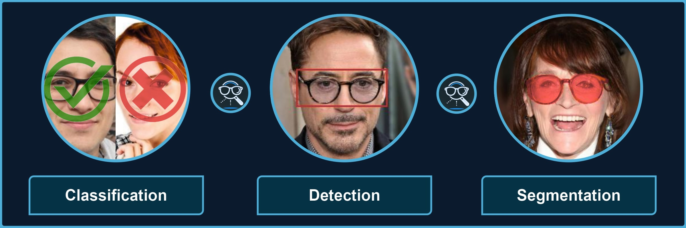

Glasses Detector
================

About
-----

Package for processing images with different types of glasses and their parts. It provides a quick way to use the pre-trained models for **3** kinds of tasks, each being divided to multiple categories, for instance, *classification of sunglasses* or *segmentation of glasses frames* (see :doc:`docs/features` for more details):

* **Classification**: transparent, sunglasses, any glasses
* **Detection**: solo, worn, eye-area
* **Segmentation**: frames, lenses, legs, shadows, full, smart

+--------------------------+----------------------------+---------------------------------------------+
| Classification           | Detection                  | Segmentation                                |
+==========================+============================+=============================================+
| Transparent, opaque, any | Worn, standalone, eye-area | Full, frames, hybrid, legs, lenses, shadows |
+--------------------------+----------------------------+---------------------------------------------+

The processing can be launched via the command line or written in a *Python* script. Based on the selected task, an image or a directory of images will be processed and corresponding predictions, e.g., labels or masks, will be generated.

.. seealso:: 

   Refer to |repo_link| for information about the datasets used and how to train or test your own models. Model fitting and evaluation can be simply launched through terminal with commands integrated from `PyTorch Lightning CLI <https://lightning.ai/docs/pytorch/stable/cli/lightning_cli.html#lightning-cli>`_.

.. |repo_link| raw:: html

    <a href="https://github.com/mantasu/glasses-detector" target="_blank" style="text-decoration:none">
        <i class="fab fa-github style="margin-right: 0.3em;"></i>
        <u>GitHub repository</u>
        <i class="fa-solid fa-up-right-from-square fa-2xs"></i>
    </a>

Contents
--------

.. toctree::
   :maxdepth: 2
   :name: index-toctree

   docs/install
   docs/features
   docs/examples
   docs/cli
   docs/api
   docs/credits

Indices and Tables
------------------

* :ref:`genindex`
* :ref:`modindex`
* :ref:`search`
